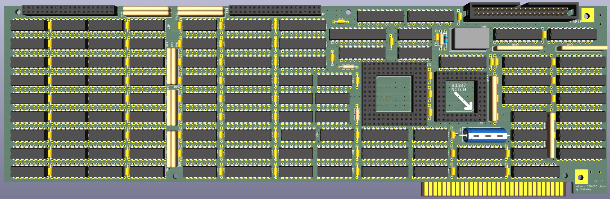
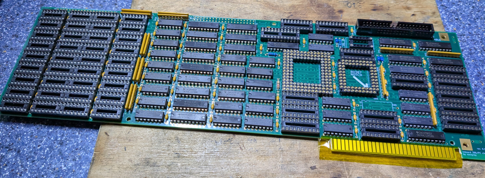
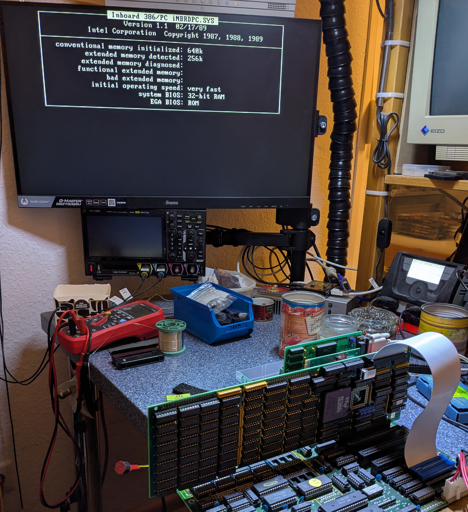

# Intel Inboard 386/PC Clone
https://forum.theretroweb.com/t/intel-inboard-386-pc-accelerator-clone/44

  
  
This is a project to reverse engineer and reproduce the [Intel Inboard 386/PC Accelerator Card](https://theretroweb.com/expansioncards/s/intel-inboard-386-pc).  
It's based on a damaged card that i obtained a while ago and managed to fix but decided to sacrifice for a reproduction.  
The Inboard 386/PC is an upgrade card from Intel for the IBM PC/XT and clones that upgraded the 8088 CPU to a 16MHz 386DX and up to 5MB of system memory.  
The card only uses standard 74 series logic chips along with some PALs/PROMs that were luckily not secured and were successfully dumped.  
The PCB is a 6 layer design with 4 signal layers. To aid with reverse engineering it i ended up choosing the destructive route and sanded the entire PCB down to the inner layers.  
By now the PCB design has been completed while the schematic still needs cleanup and further reverse engineering of the programmable logic to completely understand.  

The first revision of the board has been tested and confirmed to be working.  
GAL replacements for the PAL chips and a PROM replacement board have been tested as well.  
  
A memory expansion board is currently in work.

This current board design is a 1:1 copy of the original PCB, excluding some small details.  
A future plan is to do a redesign to condense parts of the logic into one or more CPLDs and integrate the optional external memory expansion boards into the design
